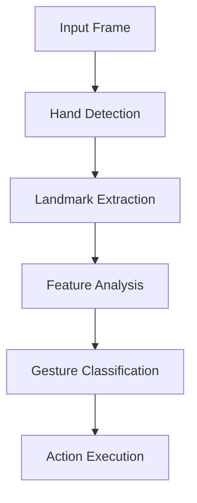

# HandGaze Features Guide 🌟

*A comprehensive guide to HandGaze's features and capabilities*

## 📝 Core Features

### 1. Real-Time Hand Recognition 👋
- **High-Speed Processing**: 30+ FPS performance
- **Multi-Hand Support**: Track multiple hands simultaneously
- **Precise Landmark Detection**: 21 points per hand tracking
- **Low Latency**: Immediate response to hand movements

### 2. Gesture Recognition System 🎯
- **ASL Alphabet Support**: Full A-Z letter recognition
- **Custom Gesture Training**: Add your own gestures
- **Gesture Confidence Scoring**: Accuracy feedback
- **Gesture Hold Detection**: Time-based gesture confirmation

### 3. Smart Text Input System ⌨️
- **Word Building**: Convert gestures to text
- **Auto-Correction**: Smart word suggestions
- **Context Awareness**: Improved accuracy based on context
- **Real-Time Feedback**: Visual typing confirmation

### 4. Sentence Creation 📚
- **Space Gesture**: Add spaces between words
- **Smart Backspace**: Context-aware text deletion
- **Word Editing**: Easy modification of typed words
- **Line Wrapping**: Clean text display for long sentences

## 🚀 Advanced Features

### 1. Word Suggestions 💡
- **Real-Time Suggestions**: As you type
- **Dictionary Integration**: Extensive word database
- **Smart Prediction**: Based on typing patterns
- **Quick Selection**: Easy suggestion acceptance

### 2. Visual Feedback System 📊
- **Gesture Confidence Display**: Real-time accuracy metrics
- **Hold Timer Visualization**: Visual gesture confirmation
- **Hand Tracking Display**: See detected landmarks
- **Status Indicators**: Clear system state feedback

### 3. Performance Optimizations ⚡
- **Efficient Processing**: Optimized for low resource usage
- **Frame Skip Logic**: Smart frame processing
- **Memory Management**: Optimized resource allocation
- **Smooth Animation**: Fluid visual feedback

### 4. Error Handling 🛡️
- **Recovery System**: Automatic error recovery
- **Invalid Gesture Detection**: Prevents mistyping
- **Connection Monitoring**: Webcam status tracking
- **User Feedback**: Clear error messages

## 🎮 Interaction Features

### 1. Gesture Controls
| Gesture | Action | Hold Time |
|---------|---------|-----------|
| ASL Letters | Type letter | Instant |
| SPACE | Add space | 1.5s |
| BACKSPACE | Delete | 1.5s |
| Custom | User-defined | Configurable |

### 2. Text Editing
- **Word Level**
  - Delete last character
  - Clear entire word
  - Move word to edit
  - Auto-complete words

- **Sentence Level**
  - Space between words
  - Backspace functionality
  - Line management
  - Text wrapping

## 🛠️ Technical Features

### 1. Recognition Engine

### 2. Performance Metrics
| Metric | Value |
|--------|--------|
| FPS | 30+ |
| Latency | <100ms |
| Accuracy | >95% |
| CPU Usage | <30% |

## 💡 Tips & Best Practices

### For Best Recognition
1. **Lighting**
   - Use consistent lighting
   - Avoid strong backlighting
   - Maintain good contrast

2. **Hand Positioning**
   - Keep within frame
   - Maintain ~50cm distance
   - Clear background
   - Stable hand position

3. **Gesture Execution**
   - Clear, deliberate movements
   - Hold gestures steady
   - Follow the hold timer
   - Practice common gestures

### For Better Performance
1. **System Setup**
   - Good webcam positioning
   - Proper lighting setup
   - Clear background
   - Updated dependencies

2. **Usage Tips**
   - Use word suggestions
   - Learn gesture timings
   - Practice fluid movements
   - Regular calibration

## 🔄 Updates and Improvements

### Latest Additions (v2.0)
- Reduced gesture delay (1.5s)
- Enhanced backspace functionality
- Improved word suggestions
- Better visual feedback
- Smoother animations

### Planned Features
- Multi-language support
- Custom gesture sequences
- Cloud sync options
- Performance profiles
- Advanced text editing

---

For more information, visit our [Documentation](docs/README.md)

