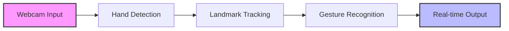
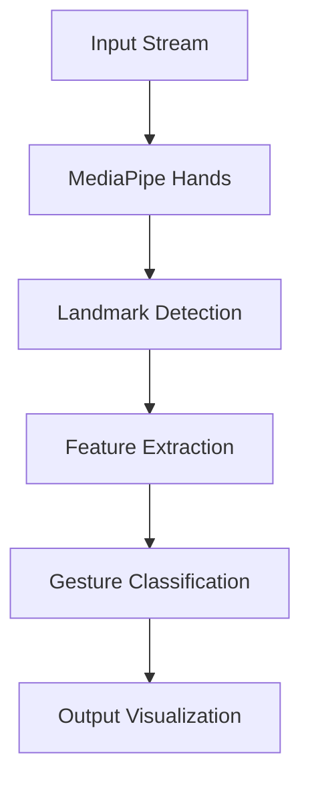

# HandGaze 👋 

<div align="center">


[](https://www.python.org/)
[](https://mediapipe.dev/)
[](https://opencv.org/)
[](LICENSE)

*Transform your hand gestures into digital commands with real-time AI-powered recognition* 🚀

[Features](#-features) • [Installation](#-installation) • [Usage](#-usage) • [Documentation](#-documentation) • [Contributing](#-contributing)

---

</div>

## 🌟 What is HandGaze?

HandGaze is a cutting-edge computer vision application that brings hand gesture recognition to life. Using advanced AI and computer vision techniques, it transforms your webcam into a sophisticated gesture recognition system.

<div align="center">



</div>

## ✨ Features

<div align="center">

| Feature | Description |
|---------|-------------|
| 🎯 Real-time Recognition | Instant hand tracking and gesture detection |
| 🎨 Custom Gestures | Train your own unique gesture patterns |
| 🔤 ASL Support | Full alphabet (A-Z) recognition capability |
| ⚡ High Performance | Optimized for 30+ FPS processing |
| 📊 Visual Feedback | Real-time landmark visualization |
| 🎮 Interactive UI | User-friendly interface with confidence metrics |

</div>

## 🚀 Getting Started

### Prerequisites

<details>
<summary>Click to expand</summary>

- Python 3.7 or higher
- Webcam
- Required packages:
  ```bash
  pip install -r requirements.txt
  ```
</details>

### 🔧 Installation

1️⃣ **Clone the Repository**
```bash
git clone https://github.com/yourusername/HandGaze.git
cd HandGaze
```

2️⃣ **Set Up Environment**
```bash
python -m venv env
source env/bin/activate  # Linux/Mac
# or
.\env\Scripts\activate  # Windows
```

3️⃣ **Install Dependencies**
```bash
pip install -r requirements.txt
```

## 🎮 Usage

### Train Custom Gestures
```bash
python gesture_trainer.py
```
> Follow the interactive prompts to record your custom gestures!

### Run Recognition

Choose your mode:

<details>
<summary>🔵 Basic Recognition</summary>

```bash
python hand-recognition.py
```
- Perfect for getting started
- Pre-configured gesture sets
- Optimized for performance
</details>

<details>
<summary>🔴 Custom Recognition</summary>

```bash
python custom_hand_recognition.py
```
- Use your trained gestures
- Advanced recognition features
- Higher accuracy for custom patterns
</details>

## 🛠️ System Architecture

<div align="center">



</div>

## 📝 Supported Gestures

### American Sign Language (ASL)
- Full alphabet support (A-Z)
- High-accuracy recognition
- Real-time feedback

### Custom Gestures
- User-defined patterns
- Extensible gesture library
- Easy training process

## 💡 Tips & Tricks

<details>
<summary>Click for best practices</summary>

- 🎥 Ensure good lighting
- 🖐️ Keep hand within frame
- 📏 Maintain ~50cm distance
- 🎯 Use clear, deliberate movements
</details>

## 🤝 Contributing

We welcome contributions! Here's how you can help:

1. 🍴 Fork the repository
2. 🔧 Create your feature branch
3. ✨ Add your improvements
4. 📝 Submit a pull request

## 📄 License

This project is licensed under the GNU License - see the [LICENSE](LICENSE) file for details.

## 🙏 Acknowledgments

- MediaPipe team for their groundbreaking hand tracking solution
- OpenCV community for comprehensive computer vision tools
- All contributors who have helped shape HandGaze

<div align="center">

---


*Last updated: January 11, 2025*

</div>
