# HandGaze 👋 

<div align="center">


[](https://www.python.org/)
[](https://mediapipe.dev/)
[](https://opencv.org/)
[](LICENSE)

> *Transform your hand gestures into digital communication with AI-powered recognition* ✨

[Features](docs/FEATURES.md) • [Installation](#-quick-start) • [Usage](#-basic-usage) • [Documentation](docs/README.md)

---

<p align="center">
  
</p>

</div>

## 📚 Quick Documentation

<div align="center">

<table>
<tr>
<td align="center" width="25%">

### 📖
[Full Documentation](docs/README.md)

Complete guide

</td>
<td align="center" width="25%">

### ✨
[Features Guide](docs/FEATURES.md)

All features

</td>
<td align="center" width="25%">

### 🎯
[API Reference](docs/README.md#-api-reference)

Technical details

</td>
<td align="center" width="25%">

### 🔧
[Troubleshooting](docs/README.md#-troubleshooting)

Common issues

</td>
</tr>
</table>

</div>

## 🌟 What is HandGaze?

HandGaze is a cutting-edge computer vision application that revolutionizes digital communication through AI-powered hand gesture recognition. Create sentences, type words, and interact with your computer using natural hand movements - all in real-time!

```mermaid
graph LR
    A[👁️ Camera Input] --> B[🤚 Hand Detection]
    B --> C[📍 Landmark Tracking]
    C --> D[🎯 Gesture Recognition]
    D --> E[💭 Word Processing]
    E --> F[📝 Sentence Creation]
    style A fill:#ff9999,stroke:#ff0000,stroke-width:2px,color:#990000,font-weight:bold
    style B fill:#99ff99,stroke:#00ff00,stroke-width:2px,color:#006600,font-weight:bold
    style C fill:#9999ff,stroke:#0000ff,stroke-width:2px,color:#000099,font-weight:bold
    style D fill:#ffff99,stroke:#ffff00,stroke-width:2px,color:#999900,font-weight:bold
    style E fill:#ff99ff,stroke:#ff00ff,stroke-width:2px,color:#990099,font-weight:bold
    style F fill:#99ffff,stroke:#00ffff,stroke-width:2px,color:#009999,font-weight:bold
    linkStyle default stroke:#333333,stroke-width:2px
```

<div align="center">



</div>

## ✨ Features

- 🎯 **Real-time Hand Recognition**
  - Advanced hand tracking using MediaPipe
  - Robust landmark detection
  - Real-time gesture feedback

- 🔤 **Gesture Training System**
  - Interactive gesture training interface
  - Visual feedback during training
  - Gesture testing with confidence scoring
  - Automatic data backup and validation

- 📚 **Smart Dictionary Integration**
  - Offline dictionary with spell checking
  - Word suggestions and auto-correction
  - Enhanced word frequency analysis
  - Efficient data storage and retrieval

- 🎨 **User Experience**
  - Intuitive visual feedback
  - Progress tracking
  - Real-time confidence scoring
  - Error handling and recovery

## 🎯 Latest Updates (v2.1)

<table>
<tr>
<td width="50%">

### ✨ New Features

- **Enhanced Gesture Recognition**
  - Improved accuracy (95%+)
  - Faster response time (0.8s)
  - Multi-hand support
  
- **Advanced Text Processing**
  - Predictive text suggestions
  - Auto-capitalization
  - Punctuation gestures

</td>
<td width="50%">

### 🛠️ Technical Updates

- **Core Improvements**
  - Optimized MediaPipe integration
  - Reduced CPU usage by 30%
  - Better error recovery

- **User Experience**
  - Dynamic confidence indicators
  - Gesture training improvements
  - Real-time performance metrics

</td>
</tr>
</table>

## 🚀 Quick Start

### 📋 Prerequisites

```bash
Python 3.7+
OpenCV-compatible webcam
4GB RAM minimum
Internet (for initial setup)
```

### ⚡ One-Line Installation

```bash
git clone https://github.com/notcaliper/HandGaze.git && cd HandGaze && pip install -r requirements.txt
```

### 🎮 Basic Usage

1. **Launch HandGaze**
   ```bash
   python hand_recognition.py
   ```

2. **Train Custom Gestures (Optional)**
   ```bash
   python gesture_trainer.py
   ```

3. **Gesture Controls**
   - 🔤 Use ASL gestures for letters
   - 👋 Hold "SPACE" gesture (0.8s) for spaces
   - ✌️ Hold "BACKSPACE" gesture (0.8s) to delete
   - ✊ "SHIFT" gesture for capitalization
   - 👆 "PERIOD" gesture for punctuation

## 💡 Pro Tips

<table>
<tr>
<td width="50%">

### 🎯 For Best Recognition

- Maintain good lighting
- Keep hands within frame
- Make deliberate gestures
- Position camera at eye level
- Use the training mode for custom gestures

</td>
<td width="50%">

### ⚡ For Better Performance

- Close background applications
- Enable hardware acceleration
- Update gesture database regularly
- Use suggested word completions
- Keep hands 2-3 feet from camera

</td>
</tr>
</table>

## 🛠️ Project Structure

```
HandGaze/
├── 📜 hand_recognition.py  # Main recognition system
├── 🎯 object_detector.py   # Object detection
├── 📚 offline_dictionary.py # Word suggestions
├── ⚙️ gesture_trainer.py   # Custom gesture training
├── 📋 requirements.txt     # Dependencies
├── 📖 docs/               # Documentation
│   ├── README.md          # Full guide
│   └── FEATURES.md        # Features guide
└── 📁 data/
    ├── dictionary_data/    # Word database
    └── gesture_data/       # Trained gestures
```

## 🤝 Contributing

We welcome contributions! Here's how you can help:

- 🐛 Report bugs and issues
- 💡 Suggest new features
- 🔧 Submit pull requests
- 📚 Improve documentation

## 📄 License

HandGaze is GNU GPLv3 licensed. See [LICENSE](LICENSE) for details.

---

<div align="center">

Made with ❤️ by [NotCaliper](https://github.com/notcaliper)

</div>
