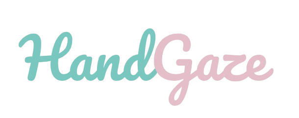

# 🖐 HandGaze - Gesture-Based Text Input System

<div align="center">



[](https://www.python.org/downloads/)
[](LICENSE)
[](https://opencv.org/)
[](https://mediapipe.dev/)

</div>

## 🚀 Overview

HandGaze is a cutting-edge gesture-based text input system that allows users to type and interact with their computer using hand gestures. By leveraging computer vision and machine learning, HandGaze provides an intuitive and hands-free way to input text.

### ✨ Key Features

- 🎯 Real-time hand gesture recognition
- ⚡️ Fast and responsive text input
- 📝 Smart word suggestions
- 🎨 Modern and intuitive UI
- 🔄 Gesture training system
- 📚 Offline dictionary support
- 🛡️ Robust error handling and state management
- 🔄 Automatic system recovery

## 🛠 Installation

```bash
# Clone the repository
git clone https://github.com/notcaliper/HandGaze.git
cd HandGaze

# Create and activate virtual environment
python -m venv venv
source venv/bin/activate  # On Windows: venv\Scripts\activate

# Install dependencies
pip install -r requirements.txt
```

## 🎮 Quick Start

1. **Train Gestures** (Optional - Skip if using pre-trained gestures)
   ```bash
   python gesture_trainer.py
   ```

2. **Run HandGaze**
   ```bash
   python hand_recognition.py
   ```

## 🎯 How to Use HandGaze

1. **Start the application**:
   - Run `python hand_recognition.py`
   - Position your camera so it can clearly see your hand

2. **Understanding the interface**:
   - **READY** (Green): System ready for a new gesture
   - **HOLD** (Yellow-Green): Hold the gesture until the bar fills
   - **WAIT** (Red): System in cooldown, wait for the bar to complete

3. **Using gestures**:
   - Position your hand to form a letter gesture
   - Hold the gesture until the progress bar completes
   - Wait for the cooldown period to finish before making the next gesture
   - Use the SPACE and BACKSPACE gestures for word completion and correction

4. **Word suggestions**:
   - The system will show word suggestions as you type
   - The most likely word will be highlighted
   - Use the SPACE gesture to accept the suggested word

## 📚 Documentation

- [System Overview](docs/SYSTEM_OVERVIEW.md) - Detailed explanation of the HandGaze system
- [Bug Fixes and Technical Details](docs/BUG_FIXES.md) - Information about recent improvements
- [Training Guide](docs/TRAINING.md) - Guide for training your own gesture set
- [Features Documentation](docs/FEATURES.md) - Description of all features
- [Technical Documentation](docs/README.md) - Technical information for developers

## 🤝 Contributing

We welcome contributions! Please see our [Contributing Guidelines](docs/CONTRIBUTING.md) for details.

## 📝 License

This project is licensed under the MIT License - see the [LICENSE](LICENSE) file for details.

## 🙏 Acknowledgments

- OpenCV team for computer vision capabilities
- MediaPipe team for hand tracking technology
- Contributors and community members

---
<div align="center">
Made with ❤️ by NotCaliper
</div>
