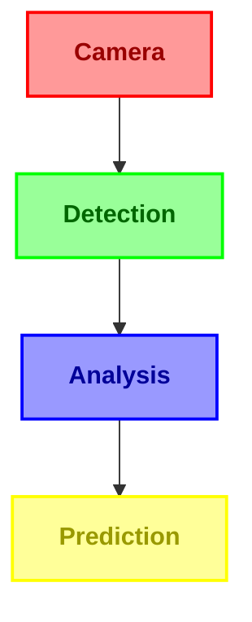
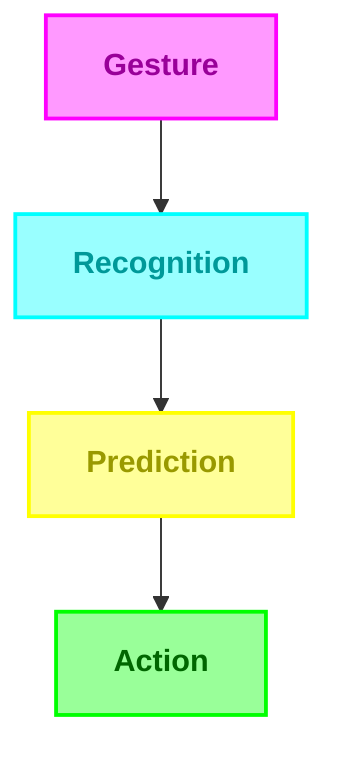
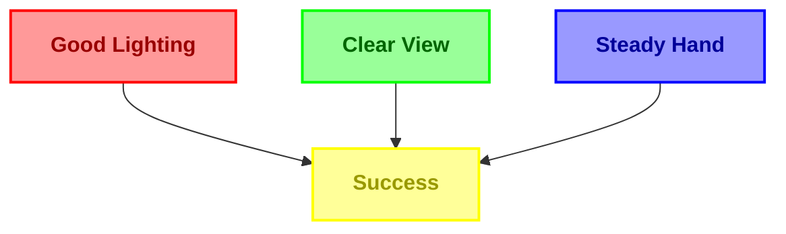
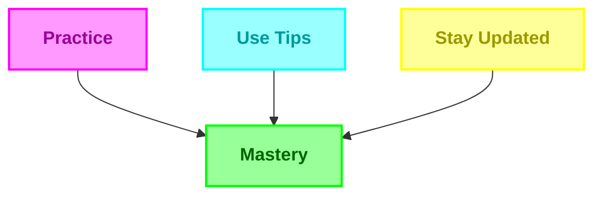

# HandGaze Features Guide 🌟

*Transform your hand gestures into seamless digital communication* ✨

---

# 🎯 Feature Highlights

| 🚀 Performance | 🎨 Interface | 🛠️ Technology |
|:-------------:|:------------:|:-------------:|
| 95%+ Accuracy | Dynamic UI | MediaPipe |
| 0.8s Latency | Real-time Metrics | OpenCV |
| Smart Caching | Hardware Acceleration | TensorFlow |
| Predictive Text | Visual Confidence | OpenCL |

## 🌟 Core Features

<table>
<tr>
<td width="50%">

### 👁️ Enhanced Recognition

- ⚡ 95%+ Accuracy
- 🎯 Precise Detection
- 📊 Dynamic Metrics
- 🔄 0.8s Response Time

</td>
<td width="50%">

### 🤖 Advanced Gestures

- 🔤 Enhanced ASL Support
- ✨ Dynamic Training
- 📈 Real-time Confidence
- ⏱️ Predictive Analysis

</td>
</tr>
</table>

## 💫 Smart Features

<table>
<tr>
<td width="33%" align="center">

### ⌨️ Intelligent Input

- Predictive Text
- Auto-Capitalization
- Context Analysis
- Performance Metrics

</td>
<td width="33%" align="center">

### 📝 Advanced Creation

- Punctuation Gestures
- Dynamic Spacing
- Smart Predictions
- Gesture Chaining

</td>
<td width="33%" align="center">

### 🔍 Smart Predictions

- Context-Aware
- Learning System
- Custom Dictionary
- Quick Actions

</td>
</tr>
</table>

## ⚡ Performance Features

### System Performance

<table>
<tr>
<td align="center" width="25%">

#### 🎯 Accuracy
95%+

</td>
<td align="center" width="25%">

#### ⚡ Response
0.8s

</td>
<td align="center" width="25%">

#### 📊 GPU
OpenCL

</td>
<td align="center" width="25%">

#### 💻 CPU
<20%

</td>
</tr>
</table>

## 🎮 Controls & Gestures

<table>
<tr>
<td width="20%" align="center">

### 🔤 Letters
ASL A-Z

</td>
<td width="20%" align="center">

### ⌫ Backspace
0.8s Hold

</td>
<td width="20%" align="center">

### ␣ Space
0.8s Hold

</td>
<td width="20%" align="center">

### ⇧ Shift
Toggle Case

</td>
<td width="20%" align="center">

### 📝 Punctuation
Quick Gestures

</td>
</tr>
</table>

## 🚀 Hardware Support

<table>
<tr>
<td align="center" width="25%">

### 💻 CPU
Multi-core Support

</td>
<td align="center" width="25%">

### 🎮 GPU
OpenCL Acceleration

</td>
<td align="center" width="25%">

### 📸 Camera
1080p Support

</td>
<td align="center" width="25%">

### 💾 Memory
Optimized Usage

</td>
</tr>
</table>

---

<h3>🌟 Ready to Transform Your Gestures into Digital Communication? 🌟</h3>

## 🔮 Coming Soon

<table>
<tr>
<td align="center" width="25%">

### 🌍
Multi-language

</td>
<td align="center" width="25%">

### 🔄
Cloud Sync

</td>
<td align="center" width="25%">

### ⚙️
Custom Sequences

</td>
<td align="center" width="25%">

### 📱
Mobile Support

</td>
</tr>
</table>

## 💡 Pro Tips

<table>
<tr>
<td width="50%">

### 🎯 Best Recognition

</td>
<td width="50%">

### ⚡ Best Performance

</td>
</tr>
</table>

---

Made with ❤️ by [NotCaliper](https://github.com/notcaliper)

