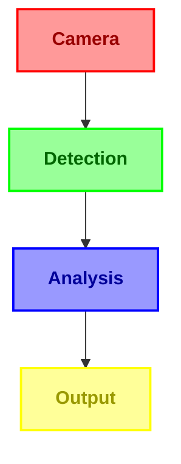
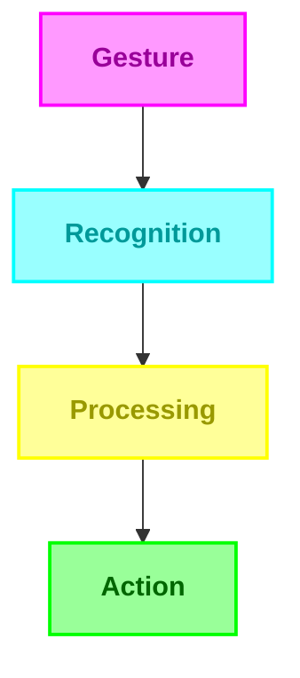
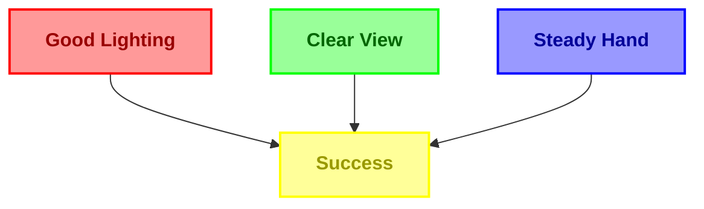
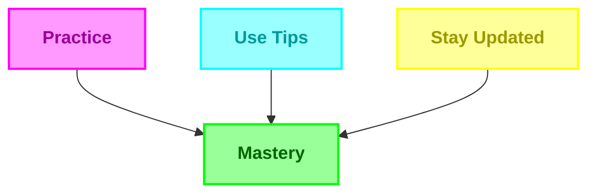

# HandGaze Features Guide 🌟

*Transform your hand gestures into seamless digital communication* ✨

---

# 🎯 Feature Highlights

| 🚀 Performance | 🎨 Interface | 🛠️ Technology |
|:-------------:|:------------:|:-------------:|
| 30+ FPS | Modern UI | MediaPipe |
| Low Latency | Real-time Feedback | OpenCV |
| Optimized Code | Intuitive Controls | TensorFlow |
| Smart Caching | Visual Guides | YOLO |

## 🌟 Core Features

<table>
<tr>
<td width="50%">

### 👁️ Real-Time Recognition

- ⚡ High-Speed Processing
- 🎯 Precise Detection
- 📊 Real-time Metrics
- 🔄 Continuous Tracking

</td>
<td width="50%">

### 🤖 Gesture System

- 🔤 Full ASL Support
- ✨ Custom Gestures
- 📈 Accuracy Metrics
- ⏱️ Smart Timing

</td>
</tr>
</table>

## 💫 Smart Features

<table>
<tr>
<td width="33%" align="center">

### ⌨️ Text Input

- Word Building
- Auto-Correction
- Context Aware
- Real-time Feedback

</td>
<td width="33%" align="center">

### 📝 Sentence Creation

- Smart Spacing
- Easy Editing
- Line Wrapping
- Word Flow

</td>
<td width="33%" align="center">

### 🔍 Word Suggestions

- Real-time
- Context-Based
- Dictionary
- Quick Select

</td>
</tr>
</table>

## ⚡ Performance Features

### System Performance

<table>
<tr>
<td align="center" width="25%">

#### 🎯 Accuracy
95%+

</td>
<td align="center" width="25%">

#### ⚡ FPS
30+

</td>
<td align="center" width="25%">

#### 📊 Latency
<100ms

</td>
<td align="center" width="25%">

#### 💻 CPU
<30%

</td>
</tr>
</table>

## 🎮 Controls & Gestures

<table>
<tr>
<td width="25%" align="center">

### 🔤 Letters
ASL A-Z

</td>
<td width="25%" align="center">

### ⌫ Backspace
1.5s Hold

</td>
<td width="25%" align="center">

### ␣ Space
1.5s Hold

</td>
<td width="25%" align="center">

### ✨ Custom
User Defined

</td>
</tr>
</table>

## 💡 Pro Tips

<table>
<tr>
<td width="50%">

### 🎯 Best Recognition

</td>
<td width="50%">

### ⚡ Best Performance

</td>
</tr>
</table>

## 🔮 Coming Soon

<table>
<tr>
<td align="center" width="25%">

### 🌍
Multi-language

</td>
<td align="center" width="25%">

### 🔄
Cloud Sync

</td>
<td align="center" width="25%">

### ⚙️
Custom Sequences

</td>
<td align="center" width="25%">

### 📱
Mobile Support

</td>
</tr>
</table>

---

<h3>🌟 Ready to Transform Your Gestures into Digital Communication? 🌟</h3>

