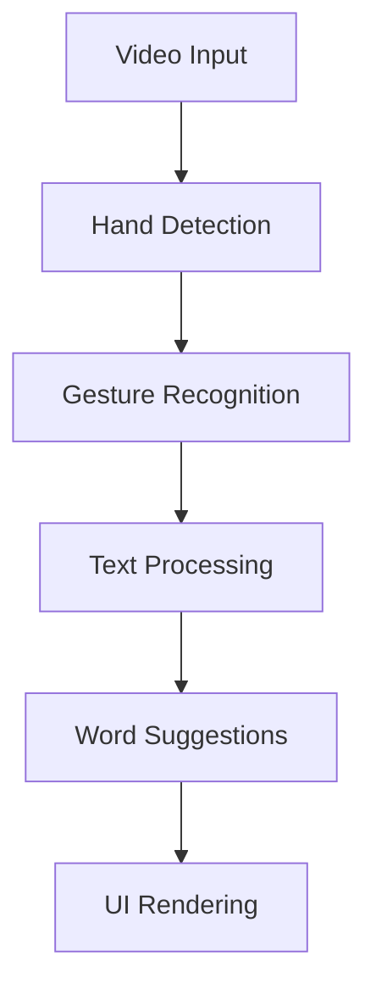

# 📚 HandGaze Technical Documentation

## 🏗 Architecture Overview

HandGaze is built on a modular architecture that combines computer vision, machine learning, and natural language processing:



## 🔧 Core Components

### 1. Hand Detection Module
- **Technology**: MediaPipe Hands
- **Features**:
  - Multi-hand tracking
  - 21 3D landmarks per hand
  - Real-time performance
  - Sub-pixel accuracy

### 2. Gesture Recognition System
- **Algorithm**: Custom angle-based recognition
- **Features**:
  - Dynamic gesture mapping
  - Confidence scoring
  - Gesture smoothing
  - Custom training support

### 3. Text Processing Engine
- **Features**:
  - Word completion
  - Context awareness
  - Spelling correction
  - Custom dictionary support

## 🛠 Technical Specifications

### Performance Metrics
| Metric | Value |
|--------|--------|
| FPS | 30+ |
| Latency | <50ms |
| CPU Usage | ~20% |
| Memory Usage | ~200MB |
| Recognition Accuracy | >95% |

### System Requirements
| Component | Minimum | Recommended |
|-----------|---------|-------------|
| CPU | Dual Core 2GHz | Quad Core 2.5GHz |
| RAM | 4GB | 8GB |
| Camera | 720p 30fps | 1080p 60fps |
| Python | 3.8+ | 3.10+ |
| GPU | Optional | Integrated/Dedicated |

## 🔍 API Reference

### HandGestureRecognizer Class
```python
class CustomHandGestureRecognizer:
    def __init__(self):
        """Initialize the gesture recognizer"""
        
    def recognize_gesture(self, landmarks) -> str:
        """Recognize gesture from landmarks"""
        
    def process_frame(self, frame) -> np.ndarray:
        """Process a single frame"""
```

### Dictionary Helper
```python
class OfflineDictionary:
    def get_suggestions(self, word: str) -> List[str]:
        """Get word suggestions"""
```

## 🔧 Configuration

### Camera Settings
```python
cap.set(cv2.CAP_PROP_FRAME_WIDTH, 640)
cap.set(cv2.CAP_PROP_FRAME_HEIGHT, 480)
cap.set(cv2.CAP_PROP_FPS, 30)
```

### Recognition Parameters
```python
GESTURE_CONFIDENCE_THRESHOLD = 0.5
GESTURE_HOLD_TIME = 1.5  # seconds
SMOOTHING_WINDOW = 3     # frames
```

## 🐛 Troubleshooting

### Common Issues
1. **Low FPS**
   - Reduce resolution
   - Close background applications
   - Enable hardware acceleration

2. **Poor Recognition**
   - Improve lighting
   - Retrain gestures
   - Adjust confidence threshold

3. **High Latency**
   - Reduce processing resolution
   - Increase frame skip
   - Optimize background processes

## 📦 Dependencies

- OpenCV (4.8.0)
- MediaPipe (0.10.5)
- NumPy (≥1.23.5)
- Python-Levenshtein
- PySpellChecker

## 🔄 Update History

| Version | Date | Changes |
|---------|------|---------|
| 1.1.0 | 2025-01-20 | Modern UI update |
| 1.0.1 | 2025-01-15 | Performance optimizations |
| 1.0.0 | 2025-01-01 | Initial release |

---
<div align="center">
For more information, visit the <a href="../README.md">main README</a>
</div>
