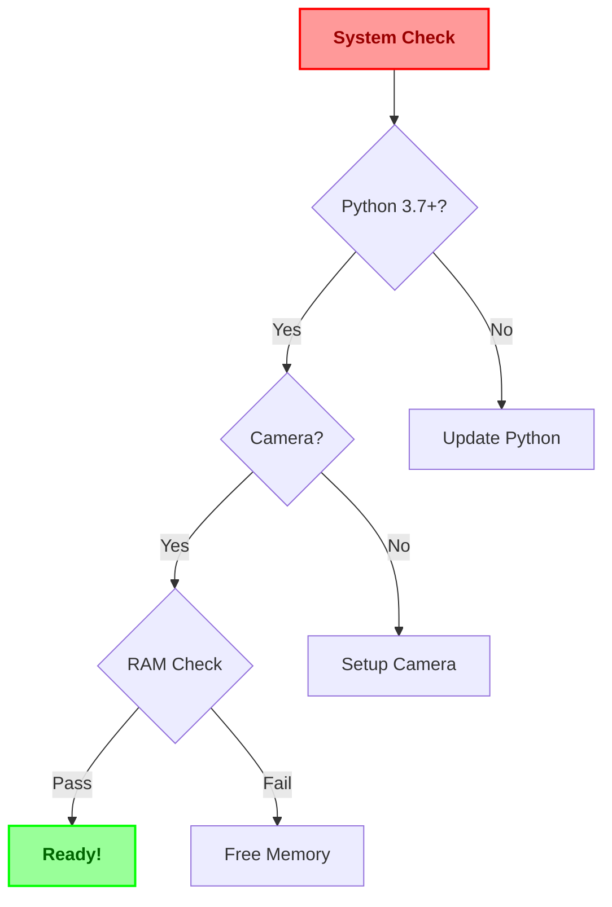
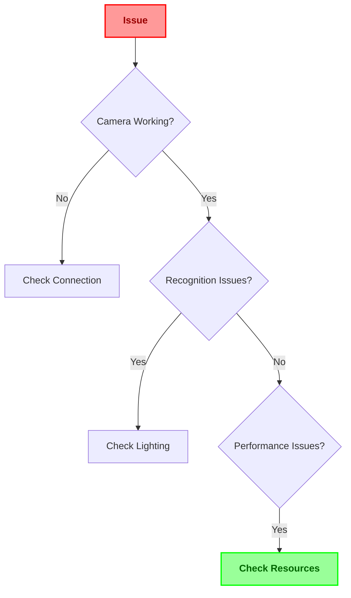

# HandGaze Documentation 📚

<div align="center">

[](https://github.com/notcaliper/HandGaze)
[](https://github.com/notcaliper/HandGaze/releases)
[](https://www.python.org/)
[](https://opencv.org/)

*Your comprehensive guide to mastering HandGaze* 🌟


---

<kbd>[Getting Started](#-getting-started)</kbd> • 
<kbd>[Installation](#-installation-guide)</kbd> • 
<kbd>[Usage](#-basic-usage)</kbd> • 
<kbd>[API](#-api-reference)</kbd> • 
<kbd>[Help](#-need-help)</kbd>

</div>

## 📑 Quick Navigation

<div align="center">

<table>
<tr>
<td align="center" width="20%">

### 🚀
[Quick Start](#-getting-started)

</td>
<td align="center" width="20%">

### 📥
[Install](#-installation-guide)

</td>
<td align="center" width="20%">

### 🎮
[Usage](#-basic-usage)

</td>
<td align="center" width="20%">

### 🔧
[Setup](#-setup-guide)

</td>
<td align="center" width="20%">

### 💡
[Tips](#-pro-tips)

</td>
</tr>
</table>

</div>

## 🚀 Getting Started

<table>
<tr>
<td width="60%">

### System Requirements

#### Minimum Requirements
```yaml
Hardware:
  CPU: Dual-core 2GHz+
  RAM: 2GB
  Camera: Basic webcam
  Storage: 500MB

Software:
  OS: Windows 10/macOS/Linux
  Python: 3.7+
  Packages: See requirements.txt
```

#### Recommended Setup
```yaml
Hardware:
  CPU: Quad-core 3GHz+
  RAM: 4GB+
  Camera: HD Webcam (720p+)
  Storage: 1GB+

Software:
  OS: Latest version
  Python: 3.9+
  GPU: Basic GPU support
```

</td>
<td width="40%">

### Compatibility Check



</td>
</tr>
</table>

## 📥 Installation Guide

### Quick Install

<div align="center">

```bash
git clone https://github.com/notcaliper/HandGaze.git && cd HandGaze && pip install -r requirements.txt
```

</div>

### Detailed Setup

<table>
<tr>
<td width="33%">

### 🐍 Python Setup

```bash
# Check Python
python --version

# Create environment
python -m venv env

# Activate
source env/bin/activate
```

</td>
<td width="33%">

### 📦 Dependencies

```bash
# Core packages
pip install -r requirements.txt

# Verify installation
python -c "import cv2; print(cv2.__version__)"
```

</td>
<td width="33%">

### 🎥 Camera Setup

```bash
# Test camera
python -c "import cv2; cap=cv2.VideoCapture(0)"

# Check permissions
ls -l /dev/video0
```

</td>
</tr>
</table>

## 🎮 Basic Usage

### Core Functions

<table>
<tr>
<td width="50%">

### 🤚 Gesture Recognition

```python
# Initialize recognizer
recognizer = CustomHandGestureRecognizer()

# Start recognition
recognizer.run()

# Custom gesture
recognizer.add_custom_gesture("PEACE", 
    landmarks_data)
```

</td>
<td width="50%">

### ⌨️ Text Input System

```python
# Text processing
text = recognizer.process_gesture("A")

# Word suggestions
suggestions = dictionary.get_suggestions(
    current_word)

# Sentence building
sentence = recognizer.build_sentence(
    words, spacing=True)
```

</td>
</tr>
</table>

### Gesture Guide

<div align="center">

<table>
<tr>
<td align="center" width="20%">

### 🔤
Letters (A-Z)


</td>
<td align="center" width="20%">

### ␣
Space


</td>
<td align="center" width="20%">

### ⌫
Backspace


</td>
<td align="center" width="20%">

### ✨
Custom


</td>
<td align="center" width="20%">

### 🔄
Reset


</td>
</tr>
</table>

</div>

## 🔧 Setup Guide

### Environment Configuration

<table>
<tr>
<td width="50%">

### 📁 Project Structure

```
HandGaze/
├── 📜 hand_recognition.py
├── 🎯 object_detector.py
├── 📚 offline_dictionary.py
├── ⚙️ gesture_trainer.py
├── 📋 requirements.txt
└── 📁 data/
    ├── dictionary/
    └── gestures/
```

</td>
<td width="50%">

### ⚙️ Configuration

```python
# config.py
SETTINGS = {
    'camera': {
        'width': 640,
        'height': 480,
        'fps': 30
    },
    'recognition': {
        'confidence': 0.5,
        'min_detection': 0.5
    },
    'gestures': {
        'hold_time': 1.5,
        'buffer_size': 3
    }
}
```

</td>
</tr>
</table>

## 💡 Pro Tips

<div align="center">

<table>
<tr>
<td align="center" width="25%">

### 🎯 Accuracy

- Good lighting
- Clear background
- Steady hands
- Proper distance

</td>
<td align="center" width="25%">

### ⚡ Performance

- Close other apps
- Update drivers
- Regular cleanup
- Optimize settings

</td>
<td align="center" width="25%">

### 🎓 Learning

- Practice basics
- Start slow
- Use tutorials
- Regular practice

</td>
<td align="center" width="25%">

### 🛠️ Maintenance

- Update regularly
- Backup data
- Check logs
- Clean cache

</td>
</tr>
</table>

</div>

## 📚 API Reference

### Core Classes

<details>
<summary><b>CustomHandGestureRecognizer</b></summary>

```python
class CustomHandGestureRecognizer:
    def __init__(self, 
                 confidence: float = 0.5,
                 use_mediapipe: bool = True):
        """
        Initialize the recognizer
        
        Args:
            confidence: Detection confidence
            use_mediapipe: Use MediaPipe
        """
        pass

    def recognize_gesture(self, 
                         landmarks: List[Point],
                         threshold: float = 0.8) -> str:
        """
        Recognize hand gesture
        
        Args:
            landmarks: Hand landmarks
            threshold: Recognition threshold
            
        Returns:
            str: Gesture name
        """
        pass

    def process_frame(self, 
                     frame: np.ndarray) -> Tuple[str, np.ndarray]:
        """
        Process video frame
        
        Args:
            frame: Input frame
            
        Returns:
            Tuple[str, np.ndarray]: 
                Gesture and annotated frame
        """
        pass
```

</details>

<details>
<summary><b>ObjectDetector</b></summary>

```python
class ObjectDetector:
    def detect_objects(self, 
                      frame: np.ndarray,
                      conf: float = 0.5) -> List[Dict]:
        """
        Detect objects in frame
        
        Args:
            frame: Input frame
            conf: Confidence threshold
            
        Returns:
            List[Dict]: Detected objects
        """
        pass
```

</details>

### Error Handling

```python
try:
    recognizer = CustomHandGestureRecognizer()
except CameraError as e:
    print(f"Camera error: {e}")
    # Handle camera issues
except ModelError as e:
    print(f"Model error: {e}")
    # Handle model issues
except ConfigError as e:
    print(f"Config error: {e}")
    # Handle configuration issues
```

## 🔍 Troubleshooting

<table>
<tr>
<td width="50%">

### Common Issues



</td>
<td width="50%">

### Solutions

| Issue | Solution |
|-------|----------|
| No Camera | Check connections |
| Poor Recognition | Improve lighting |
| Slow Performance | Close other apps |
| Crashes | Update packages |
| No Text Output | Check permissions |

</td>
</tr>
</table>

## 🤝 Contributing

<div align="center">

<table>
<tr>
<td align="center" width="25%">

### 🐛
Report Bugs

</td>
<td align="center" width="25%">

### 💡
Suggest Features

</td>
<td align="center" width="25%">

### 🔧
Submit PRs

</td>
<td align="center" width="25%">

### 📚
Improve Docs

</td>
</tr>
</table>

</div>

---

<div align="center">

## Need Help? 

<table>
<tr>
<td align="center" width="50%">

[](https://github.com/notcaliper/HandGaze/issues)

Report problems on GitHub

</td>
<td align="center" width="50%">

[](mailto:akshaymanbhaw27@gmail.com)

Contact support team

</td>
</tr>
</table>

Made with ❤️ by [NotCaliper](https://github.com/notcaliper)

</div>
