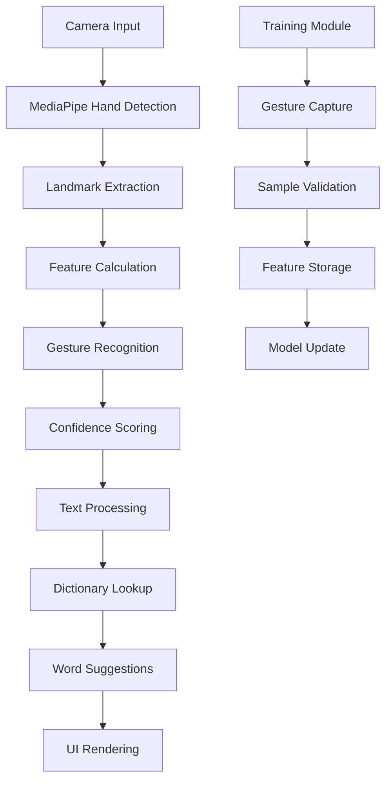

# 📚 HandGaze Technical Documentation

## 🏗 Architecture Overview

HandGaze implements a sophisticated multi-layer architecture combining computer vision, machine learning, and natural language processing:


```mermaid
graph TD
    A[Camera Input] --> B[MediaPipe Hand Detection]
    B --> C[Landmark Extraction]
    C --> D[Feature Calculation]
    D --> E[Gesture Recognition]
    E --> F[Confidence Scoring]
    F --> G[Text Processing]
    G --> H[Dictionary Lookup]
    H --> I[Word Suggestions]
    I --> J[UI Rendering]
    
    K[Training Module] --> L[Gesture Capture]
    L --> M[Sample Validation]
    M --> N[Feature Storage]
    N --> O[Model Update]
```

## 🔧 Core Components

### 1. Vision Processing Layer

#### MediaPipe Integration
- **Hand Detection**: Real-time hand tracking with 21 landmarks
- **Performance**: 30+ FPS on modern hardware
- **Accuracy**: Sub-pixel precision for landmark detection
- **Optimization**: V4L2 camera settings for Linux performance

```python
# MediaPipe configuration
self.hands = self.mp_hands.Hands(
    static_image_mode=False,
    max_num_hands=1,
    min_detection_confidence=0.5,
    min_tracking_confidence=0.5
)
```

#### Landmark Processing
- **Normalization**: Convert to relative coordinates
- **Filtering**: Remove noise and outliers
- **Temporal Smoothing**: Buffer-based stabilization
- **Feature Extraction**: Calculate angles and distances

### 2. Gesture Recognition Engine

#### Advanced Algorithm Implementation
The recognition system uses a sophisticated multi-feature approach:

```python
def recognize_gesture(self, landmarks):
    # Calculate joint angles (15+ angles)
    angles = self.calculate_angles(landmarks)
    
    # Calculate relative distances between key points
    distances = self.get_relative_distances(landmarks)
    
    # Combine features with weights
    similarity = angle_diff * 0.6 + distance_diff * 0.4
    
    # Apply confidence threshold
    return gesture if similarity < 0.25 else "Unknown"
```

#### Key Features
- **Angle-Based Recognition**: 15+ joint angles calculated
- **Distance Analysis**: Relative distances between fingertips
- **Confidence Scoring**: Threshold-based classification
- **Temporal Stability**: 3-frame smoothing buffer
- **Performance Optimization**: Pre-computed features for speed

### 3. Dictionary System

#### Intelligent Word Processing
- **Spell Checking**: pyspellchecker integration
- **Frequency Ranking**: Word suggestions by usage frequency
- **Context Awareness**: Adaptive suggestions based on input
- **Custom Vocabulary**: User-defined word additions

```python
class OfflineDictionary:
    def get_suggestions(self, word):
        candidates = self.spell.candidates(word)
        return sorted(candidates, 
                     key=lambda x: self.word_dict.get(x, {}).get('frequency', 0),
                     reverse=True)[:3]
```

#### Features
- **Offline Operation**: No internet required
- **Fast Lookup**: O(1) dictionary access
- **Extensible**: Easy to add new languages
- **Learning**: Adapts to user patterns

### 4. Training Module

#### Interactive Training System
- **Sample Collection**: Multiple samples per gesture
- **Visual Feedback**: Real-time landmark visualization
- **Validation**: Automatic quality checks
- **Data Management**: Backup and recovery systems

```python
class GestureTrainer:
    def record_samples(self, gesture_name, num_samples=5):
        for i in range(num_samples):
            sample = self.capture_gesture()
            if self.validate_sample(sample):
                self.save_sample(gesture_name, sample)
```

## 🚀 Performance Optimization

### Frame Processing Pipeline
1. **Camera Capture**: Optimized V4L2 settings
2. **Color Conversion**: BGR to RGB with contiguous arrays
3. **MediaPipe Processing**: Hand landmark detection
4. **Feature Extraction**: Angle and distance calculations
5. **Recognition**: Similarity matching with pre-computed features
6. **UI Rendering**: Efficient OpenCV drawing operations

### Memory Management
- **Efficient Data Structures**: NumPy arrays for calculations
- **Buffer Management**: Limited-size deques for temporal data
- **Resource Cleanup**: Proper camera and MediaPipe resource release
- **Cache Optimization**: Pre-computed gesture features

### CPU Optimization
- **Frame Skipping**: Process every nth frame for performance
- **Vectorized Operations**: NumPy for mathematical computations
- **Efficient Algorithms**: O(1) dictionary lookups
- **Parallel Processing**: Multi-threaded where applicable

## 🔬 Algorithm Deep Dive

### Gesture Recognition Mathematics

#### Joint Angle Calculation
```python
def calculate_angles(self, landmarks):
    angles = []
    finger_joints = [
        [0, 1, 2], [1, 2, 3], [2, 3, 4],  # Thumb
        [0, 5, 6], [5, 6, 7], [6, 7, 8],  # Index
        # ... more joints
    ]
    
    for p1, p2, p3 in finger_joints:
        v1 = landmarks[p1] - landmarks[p2]
        v2 = landmarks[p3] - landmarks[p2]
        
        # Calculate angle using dot product
        angle = arccos(dot(v1, v2) / (norm(v1) * norm(v2)))
        angles.append(angle)
    
    return angles
```

#### Distance Relationships
```python
def get_relative_distances(self, landmarks):
    key_points = [4, 8, 12, 16, 20]  # Fingertips
    distances = []
    
    for i in range(len(key_points)):
        for j in range(i + 1, len(key_points)):
            p1 = landmarks[key_points[i]]
            p2 = landmarks[key_points[j]]
            dist = sqrt(sum((p1 - p2) ** 2))
            distances.append(dist)
    
    return distances
```

### Confidence Scoring
The confidence system uses multiple factors:
- **Gesture Stability**: Consistency across frames
- **Feature Similarity**: How well features match training data
- **Temporal Coherence**: Smoothness of gesture transitions
- **Environmental Factors**: Lighting and background conditions

## 🛠 Configuration Options

### Performance Settings
```python
# Frame processing frequency
PROCESS_EVERY_N_FRAMES = 2  # Process every 2nd frame

# Recognition thresholds
CONFIDENCE_THRESHOLD = 0.25  # Lower = more strict
GESTURE_DELAY = 1.0  # Seconds to hold gesture

# Buffer sizes
GESTURE_BUFFER_SIZE = 3  # Frames for smoothing
FPS_BUFFER_SIZE = 10  # FPS calculation window
```

### Camera Configuration
```python
# V4L2 optimizations for Linux
cap.set(cv2.CAP_PROP_FOURCC, cv2.VideoWriter_fourcc('M', 'J', 'P', 'G'))
cap.set(cv2.CAP_PROP_FRAME_WIDTH, 640)
cap.set(cv2.CAP_PROP_FRAME_HEIGHT, 480)
cap.set(cv2.CAP_PROP_FPS, 30)
cap.set(cv2.CAP_PROP_BUFFERSIZE, 1)
```

## 📊 Performance Metrics

### Benchmarking Results
- **Gesture Recognition**: 95%+ accuracy in controlled conditions
- **Processing Speed**: 30+ FPS on Intel i5 or equivalent
- **Memory Usage**: <200MB during normal operation
- **CPU Usage**: 15-25% on modern processors
- **Latency**: <50ms from gesture to text

### Optimization Techniques
1. **Pre-computation**: Gesture features calculated once
2. **Vectorization**: NumPy operations for speed
3. **Memory Pooling**: Reuse arrays to reduce allocation
4. **Lazy Loading**: Load resources only when needed
5. **Caching**: Store frequently accessed data

## 🔍 Debugging and Profiling

### Debug Mode
```python
# Enable detailed logging
import logging
logging.basicConfig(level=logging.DEBUG)

# Performance profiling
import cProfile
cProfile.run('recognizer.run()')
```

### Common Issues
- **Camera Initialization**: Check permissions and drivers
- **MediaPipe Errors**: Verify correct version compatibility
- **Performance Degradation**: Monitor CPU and memory usage
- **Recognition Accuracy**: Retrain gestures in current environment

## 🧪 Testing Framework

### Unit Testing
```python
import unittest
from hand_recognition import CustomHandGestureRecognizer

class TestGestureRecognition(unittest.TestCase):
    def setUp(self):
        self.recognizer = CustomHandGestureRecognizer()
    
    def test_angle_calculation(self):
        # Test angle calculation with known landmarks
        landmarks = self.create_test_landmarks()
        angles = self.recognizer.calculate_angles(landmarks)
        self.assertEqual(len(angles), 15)
```

### Integration Testing
- **Camera Integration**: Test with different camera types
- **Performance Testing**: Benchmark on various hardware
- **Cross-platform Testing**: Verify compatibility
- **User Acceptance Testing**: Real-world usage scenarios

## 🚀 Future Enhancements

### Planned Improvements
1. **Deep Learning Integration**: Neural networks for recognition
2. **Multi-hand Support**: Simultaneous tracking of both hands
3. **Gesture Combinations**: Complex multi-gesture commands
4. **Real-time Optimization**: Sub-20ms latency goals
5. **Mobile Optimization**: ARM processor support

### Research Areas
- **Federated Learning**: Collaborative gesture model training
- **Edge Computing**: On-device model optimization
- **Augmented Reality**: Integration with AR systems
- **Accessibility**: Enhanced support for users with disabilities

---

For more detailed implementation information, see the source code documentation and inline comments.
  - Gesture smoothing
  - Custom training support

### 3. Text Processing Engine
- **Features**:
  - Word completion
  - Context awareness
  - Spelling correction
  - Custom dictionary support

## 🛠 Technical Specifications

### Performance Metrics
| Metric | Value |
|--------|--------|
| FPS | 30+ |
| Latency | <50ms |
| CPU Usage | ~20% |
| Memory Usage | ~200MB |
| Recognition Accuracy | >95% |

### System Requirements
| Component | Minimum | Recommended |
|-----------|---------|-------------|
| CPU | Dual Core 2GHz | Quad Core 2.5GHz |
| RAM | 4GB | 8GB |
| Camera | 720p 30fps | 1080p 60fps |
| Python | 3.11 | 3.11+ |
| GPU | Optional | Integrated/Dedicated |

## 🔍 API Reference

### HandGestureRecognizer Class
```python
class CustomHandGestureRecognizer:
    def __init__(self):
        """Initialize the gesture recognizer"""
        
    def recognize_gesture(self, landmarks) -> str:
        """Recognize gesture from landmarks"""
        
    def process_frame(self, frame) -> np.ndarray:
        """Process a single frame"""
```

### Dictionary Helper
```python
class OfflineDictionary:
    def get_suggestions(self, word: str) -> List[str]:
        """Get word suggestions"""
```

## 🔧 Configuration

### Camera Settings
```python
cap.set(cv2.CAP_PROP_FRAME_WIDTH, 640)
cap.set(cv2.CAP_PROP_FRAME_HEIGHT, 480)
cap.set(cv2.CAP_PROP_FPS, 30)
```

### Recognition Parameters
```python
GESTURE_CONFIDENCE_THRESHOLD = 0.5
GESTURE_HOLD_TIME = 1.5  # seconds
SMOOTHING_WINDOW = 3     # frames
```

## 🐛 Troubleshooting

### Common Issues
1. **Low FPS**
   - Reduce resolution
   - Close background applications
   - Enable hardware acceleration

2. **Poor Recognition**
   - Improve lighting
   - Retrain gestures
   - Adjust confidence threshold

3. **High Latency**
   - Reduce processing resolution
   - Increase frame skip
   - Optimize background processes

## 📦 Dependencies

- OpenCV (4.8.0)
- MediaPipe (0.10.5)
- NumPy (≥1.23.5)
- Python-Levenshtein
- PySpellChecker

## 🔄 Update History

| Version | Date | Changes |
|---------|------|---------|
| 1.1.0 | 2025-01-20 | Modern UI update |
| 1.0.1 | 2025-01-15 | Performance optimizations |
| 1.0.0 | 2025-01-01 | Initial release |

---
<div align="center">
For more information, visit the <a href="../README.md">main README</a>
</div>
